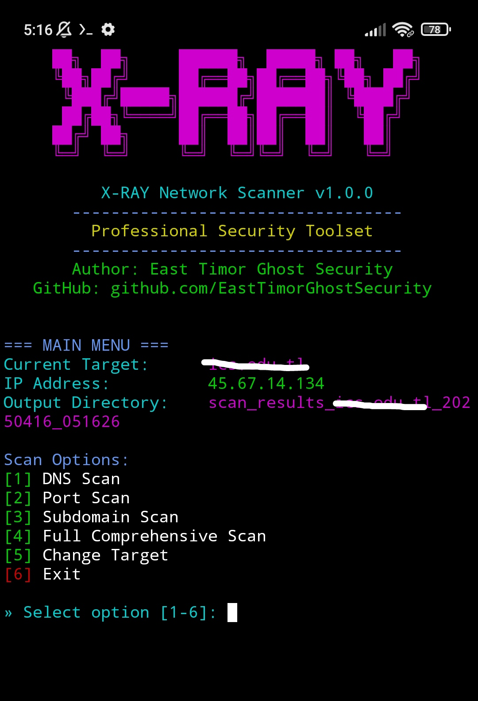

⚡ X-RAY NETWORK SCANNER 🔍

🧠 About the Tool

**X-RAY Network Scanner** is a powerful Ruby-based **reconnaissance tool** 🔧 designed to map and analyze network or domain targets with precision.

With a user-friendly and colorful interactive interface ✨, it offers a smooth experience for both professional penetration testers 👨‍💻 and general tech users 👾.

🚀 Features

- 🌐 **DNS Enumeration** (A, MX, TXT, NS records)
- 🕵️‍♂️ **Subdomain Scanning**
- ⚡ **Top 1000 Port Scan**
- 🧪 **Deep Port Scan with OS Detection**
- 🔍 **Vulnerability Detection via Nmap Scripts**
- 🎨 **Interactive CLI** with spinners, colorful results, and visual effects

---

---

---

### Install X-RAY

    pkg update && pkg upgrade -y
    pkg install git -y
    pkg install ncurses-utils
    git clone https://github.com/EastTimorGhostSecurity/X-RAY.git
    cd X-RAY
    chmod +x scaner.rb

### Launch X-RAY

    ./scaner.rb or ruby scaner.rb
---

### Author

**EastTimorGhostSecurity**

---
